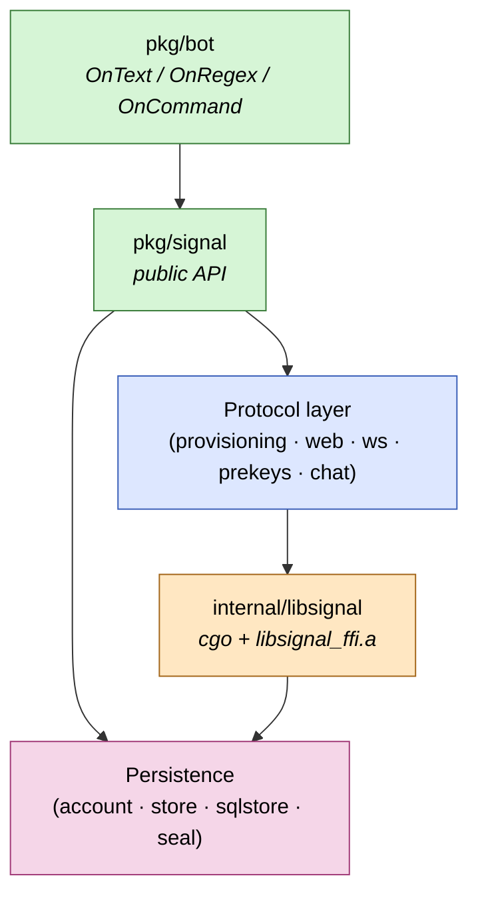

# signal-go

[](https://github.com/thehappydinoa/signal-go/actions/workflows/ci.yml)
[](https://github.com/thehappydinoa/signal-go/actions/workflows/codeql.yml)
[](https://github.com/thehappydinoa/signal-go/releases/latest)
[](./LICENSE)
[](./go.mod)
[](./scripts/build-libsignal.sh)
[](./docs/security.md)

A Go library and CLI that lets your program act as a linked **Signal**
secondary device. Cryptography flows through Signal's official Rust
[`libsignal`][libsignal] via a thin cgo binding; protocol plumbing
(websockets, REST, prekey lifecycle, sealed sender, groups v2) is
implemented in Go.

## Quick start

**From source** (Linux, macOS, or [Windows/MSYS2](./docs/guides/getting-started.md#windows-git-bash--msys2)):

```sh
git clone https://github.com/thehappydinoa/signal-go
cd signal-go
task setup      # once per clone: tools + git hooks
task libsignal  # once: build or download libsignal_ffi.a
task build      # → bin/signal-go
./bin/signal-go link -store ./.signal-data
```

**Pre-built binaries** — [GitHub Releases](https://github.com/thehappydinoa/signal-go/releases/latest).

**As a library** — `import "github.com/thehappydinoa/signal-go/pkg/signal"`.
You still need `libsignal_ffi.a`; see the [getting-started guide](./docs/guides/getting-started.md).

Full walkthrough: [`docs/guides/getting-started.md`](./docs/guides/getting-started.md).

## Architecture



Full breakdown: [`docs/diagrams/architecture.md`](./docs/diagrams/architecture.md).

## Documentation

| Topic | Link |
|-------|------|
| Build, link, Windows setup | [`docs/guides/getting-started.md`](./docs/guides/getting-started.md) |
| Creating a Signal bot | [`docs/guides/creating-a-bot.md`](./docs/guides/creating-a-bot.md) |
| Cutting a release | [`docs/guides/releasing.md`](./docs/guides/releasing.md) |
| Testing strategy | [`docs/guides/testing.md`](./docs/guides/testing.md) |
| Bot examples | [`examples/`](./examples/) |
| Architecture diagrams | [`docs/diagrams/`](./docs/diagrams/) |
| Security + threat model | [`docs/security.md`](./docs/security.md) |
| Architecture decisions | [`docs/adr/`](./docs/adr/) |
| Changelog | [`CHANGELOG.md`](./CHANGELOG.md) |
| Roadmap | [`ROADMAP.md`](./ROADMAP.md) |

## Contributing

Read [`CONTRIBUTING.md`](./CONTRIBUTING.md) and [`CLAUDE.md`](./CLAUDE.md), then run
`task setup && task libsignal && task test && task lint` before opening a PR.

Security issues: [`SECURITY.md`](./SECURITY.md) — **do not** file public GitHub issues for vulnerabilities.

## License

[AGPL-3.0-only](./LICENSE). `signal-go` statically links AGPL-licensed `libsignal`;
network deployments must comply with AGPL §13. See [ADR 0009](./docs/adr/0009-licensing.md).

---

*Not affiliated with or endorsed by Signal Messenger LLC.
Upstream `libsignal` is "use outside of Signal is unsupported"; we pin to a fixed tag.*

[libsignal]: https://github.com/signalapp/libsignal
