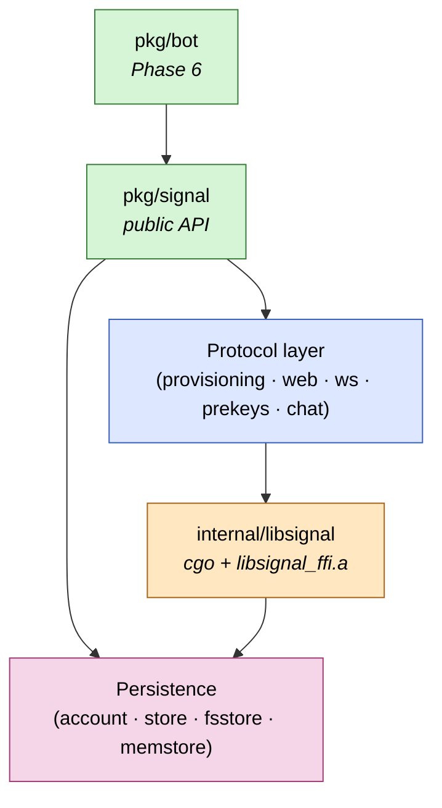

# signal-go

[](https://github.com/thehappydinoa/signal-go/actions/workflows/ci.yml)
[](https://github.com/thehappydinoa/signal-go/actions/workflows/codeql.yml)
[](./LICENSE)
[](./go.mod)
[](./scripts/build-libsignal.sh)
[](./ROADMAP.md)
[](./docs/security.md)

A Go library that lets your program act as a linked **Signal**
secondary device. Cryptography flows through Signal's official Rust
[`libsignal`][libsignal] via a thin cgo binding; the protocol plumbing
(websockets, REST, prekey lifecycle, sealed sender, groups v2) is
implemented in Go.

> **Pre-alpha.** Linking works end-to-end with encrypted-at-rest
> persistence. Real-time receive and send are next. Track progress in
> the [roadmap](./ROADMAP.md).

```sh
go install github.com/thehappydinoa/signal-go/cmd/signal-go@latest  # once we tag v0.1.0
signal-go link -store ./.signal-data
```

The CLI prompts for a passphrase, prints a `sgnl://linkdevice?...` URL
to scan, and persists an AES-256-GCM-encrypted account on disk.
See [`docs/guides/getting-started.md`](./docs/guides/getting-started.md)
for the full walkthrough.

## Highlights

- **Trust-preserving by design** — every cryptographic operation goes
  through the same `libsignal` that ships in the official Signal apps.
  No re-implemented protocol crypto.
- **PQXDH-ready** — Curve25519 + ML-KEM 1024 prekey generation and
  upload at link time, matching Signal's 2026 mandate.
- **Encrypted credentials at rest** — AES-256-GCM with an Argon2id-
  derived key (or a caller-supplied raw key). Passphrase prompts +
  `-passphrase-file` for non-interactive deployments. See
  [the encrypted-store diagram](./docs/diagrams/encrypted-store.md).
- **Small dependency surface** — `coder/websocket`, `google.golang.org/protobuf`,
  and `golang.org/x/crypto` (Argon2id). Everything else is stdlib.
- **Aimed at bots** — a `pkg/bot` framework with regex / command
  dispatchers, middleware, and scopes is the Phase 6 target.
  ([ADR 0008](./docs/adr/0008-bot-framework.md))

## Architecture



Full breakdown: [`docs/diagrams/architecture.md`](./docs/diagrams/architecture.md).

## What works · what's next

| Phase | Status | Scope |
|---|---|---|
| [1 — Foundation](./ROADMAP.md#phase-1--foundation-done) | ✅ | cgo to libsignal, ws layer, QR-link handshake |
| [2 — Complete the link](./ROADMAP.md#phase-2--complete-the-link-done-except-where-noted) | ✅ | ProvisioningCipher, prekey gen, REST registration, prekey upload |
| [Encrypted store](./docs/adr/0012-encrypted-store.md) | ✅ | AES-256-GCM at rest, Argon2id passphrase mode |
| [3 — Receive](./ROADMAP.md#phase-3--receive-in-progress) | 🔧 in progress | authenticated ws, libsignal decrypt, typed events |
| [4 — Send](./ROADMAP.md#phase-4--send-11-planned) | ⏳ | 1:1 sealed-sender send |
| [5 — Groups v2](./ROADMAP.md#phase-5--groups-v2-planned) | ⏳ | zkgroup + sender keys |
| [6 — Bot framework](./ROADMAP.md#phase-6--bot-framework-planned) | ⏳ | `pkg/bot` dispatch + middleware |
| [8 — Security audit](./ROADMAP.md#phase-8--security-audit-planned-required-before-v010) | ⏳ | internal + external review gates `v0.1.0` |

## Docs

- 📐 **[Diagrams](./docs/diagrams/)** — architecture, QR-link, encrypted store, receive, send
- 🛠️ **[Getting started](./docs/guides/getting-started.md)** — build, link your first device
- 🧪 **[Testing](./docs/guides/testing.md)** — unit, component, e2e against real Signal
- 🔒 **[Security](./docs/security.md)** — threat model, encrypted-at-rest, reporting
- 📋 **[Roadmap](./ROADMAP.md)** — staged plan through `v0.1.0`
- 📜 **[ADRs](./docs/adr/)** — every architectural decision recorded
  ([0001 architecture](./docs/adr/0001-overall-architecture.md),
  [0002 deps](./docs/adr/0002-no-third-party-go-deps.md),
  [0009 license](./docs/adr/0009-licensing.md),
  [0010 receive](./docs/adr/0010-phase-3-receive.md),
  [0011 audit](./docs/adr/0011-security-audit.md),
  [0012 encrypted store](./docs/adr/0012-encrypted-store.md)…)

## Disclaimer

Not affiliated with, endorsed by, or supported by Signal Messenger LLC.
Upstream `libsignal` is published with the explicit caveat *"use
outside of Signal is unsupported"*; we pin to a fixed tag and ride the
API breaks ourselves.

## License

[AGPL-3.0-only](./LICENSE). `signal-go` statically links AGPL-licensed
`libsignal`, so the combined binary is AGPL. If you deploy `signal-go`
(or anything built on it) as a network service, AGPL §13 obliges you to
offer source to your users. See [ADR 0009](./docs/adr/0009-licensing.md)
for the full reasoning and alternatives considered.

[libsignal]: https://github.com/signalapp/libsignal
