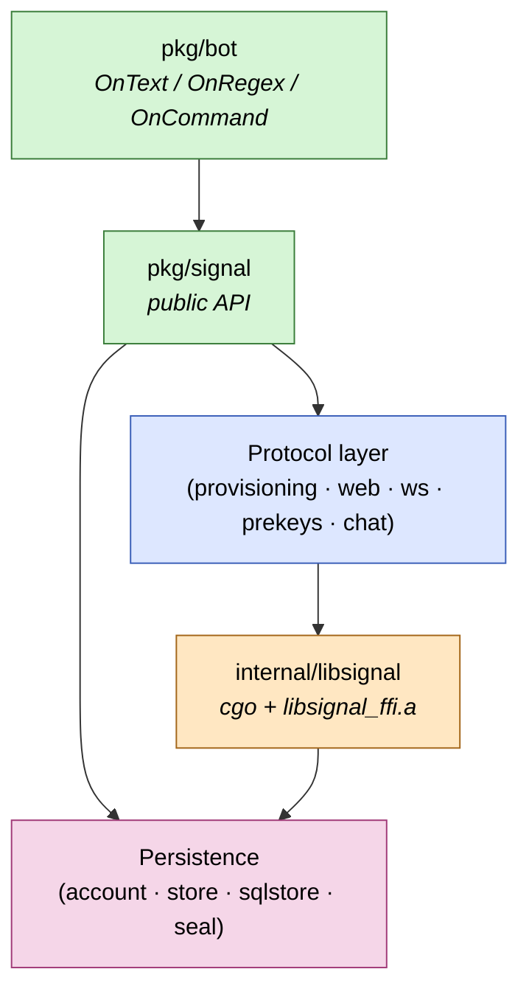

# signal-go

<!--
  CI + CodeQL badges:
  GitHub's actions/workflows/*.yml/badge.svg URLs don't render for
  unauthenticated viewers of private repos, so we use static shields.io
  badges until the repo goes public. When that happens, swap back to:

    [](https://github.com/thehappydinoa/signal-go/actions/workflows/ci.yml)
    [](https://github.com/thehappydinoa/signal-go/actions/workflows/codeql.yml)
-->
[](./.github/workflows/ci.yml)
[](./.github/workflows/codeql.yml)
[](./LICENSE)
[](./go.mod)
[](./scripts/build-libsignal.sh)
[](./ROADMAP.md)
[](./docs/security.md)

A Go library and CLI that lets your program act as a linked **Signal**
secondary device. Cryptography flows through Signal's official Rust
[`libsignal`][libsignal] via a thin cgo binding; protocol plumbing
(websockets, REST, prekey lifecycle, sealed sender, groups v2) is
implemented in Go.

> **Pre-alpha.** Linking, receive, 1:1 send, groups v2, storage sync, and
> link-and-sync are implemented and covered by CI. The next gate before
> **v0.1.0** is an external security review — see the
> [roadmap](./ROADMAP.md#phase-8--security-audit-internal-pass-done-external-pass-required-before-v010).

## Quick start

**From source** (Linux, macOS, or Windows with [MSYS2 MinGW-w64](./docs/guides/getting-started.md#windows-git-bash--msys2)):

```sh
git clone https://github.com/thehappydinoa/signal-go
cd signal-go

task setup      # once per clone: tools + git hooks
task libsignal  # once: build pinned libsignal_ffi.a (~5–10 min)
task build      # → bin/signal-go

./bin/signal-go link -store ./.signal-data
```

The CLI prompts for a passphrase, renders a **terminal QR** for the
`sgnl://linkdevice?...` link URL (see [ADR 0035](./docs/adr/0035-go-qrcode-cli-qr.md)),
and persists an AES-256-GCM-encrypted account.
Full walkthrough: [`docs/guides/getting-started.md`](./docs/guides/getting-started.md).

**Pre-built binaries** — [GitHub Releases](https://github.com/thehappydinoa/signal-go/releases)
(`v0.1.0-rc1` and later). Pick the archive for your OS/CPU, verify the
`.sha256` sidecar, and run `signal-go link` the same way.

**Maintainers** — after updating `CHANGELOG.md`, run
**Actions → Create release tag** to push a `v*` tag; that starts the
[release workflow](.github/workflows/release.yml) automatically.
See [`docs/guides/releasing.md`](./docs/guides/releasing.md).

**As a library** — import `github.com/thehappydinoa/signal-go/pkg/signal`
(and optionally `pkg/bot`). You still need `libsignal_ffi.a` built locally
or shipped with your deployment; see the getting-started guide.

```go
import "github.com/thehappydinoa/signal-go/pkg/signal"

// After Link/Open: client.Send, client.Events(), bot.OnText, …
```

## Highlights

- **Trust-preserving by design** — protocol cryptography goes through the
  same `libsignal` that ships in official Signal apps. No re-implemented
  protocol crypto.
- **PQXDH-ready** — Curve25519 + ML-KEM 1024 prekeys at link time.
- **Encrypted credentials at rest** — AES-256-GCM + Argon2id passphrase
  mode (or caller-supplied raw key). See
  [encrypted-store diagram](./docs/diagrams/encrypted-store.md).
- **Signal TLS pinning** — `*.signal.org` dials pin Signal's private root
  ([ADR 0034](./docs/adr/0034-signal-tls-root-pinning.md)); no need to
  install that CA for the CLI (browsers are a separate story — see
  troubleshooting in the getting-started guide).
- **Small dependency surface** — `coder/websocket`, `google.golang.org/protobuf`,
  `golang.org/x/crypto` (+ embedded Mozilla roots for empty OS stores on
  Windows cgo). Everything else is stdlib. Allowlist:
  [ADR 0002](./docs/adr/0002-no-third-party-go-deps.md).
- **Send + receive** — real-time chat websocket, typed events, sealed sender
  when a profile key is known, multi-device fan-out, receipts/reactions/edits.
- **Groups v2** — fetch/decrypt state, group send, membership changes,
  invite links ([ADR 0018](./docs/adr/0018-groups-v2-bootstrap.md)–[0025](./docs/adr/0025-inbound-group-updates.md)).
- **Bot dispatch** — `pkg/bot` with `OnText`, `OnCommand`, `OnRegex`,
  middleware, and `Message.Reply` / `React` / `Typing`
  ([ADR 0008](./docs/adr/0008-bot-framework.md)).

## Platforms

| Platform | CI / release | Notes |
|----------|----------------|-------|
| Linux amd64, arm64 | ✅ | Primary dev target |
| macOS amd64, arm64 | ✅ | Native release binaries |
| Windows amd64 | ⚠️ experimental | MSYS2 MinGW-w64; see [getting-started](./docs/guides/getting-started.md#windows-git-bash--msys2) |

Cross-platform releases: [ADR 0033](./docs/adr/0033-release-pipeline.md),
workflow [`.github/workflows/release.yml`](./.github/workflows/release.yml).

## Architecture



Full breakdown: [`docs/diagrams/architecture.md`](./docs/diagrams/architecture.md).

## Roadmap snapshot

| Phase | Status | Scope |
|-------|--------|--------|
| [1 — Foundation](./ROADMAP.md#phase-1--foundation-done) | ✅ | cgo, ws, QR-link handshake |
| [2 — Link](./ROADMAP.md#phase-2--complete-the-link-done-except-where-noted) | ✅ | Provisioning, prekeys, REST registration |
| [3 — Receive](./ROADMAP.md#phase-3--receive-done) | ✅ | Chat ws, decrypt, typed events |
| [4 — Send 1:1](./ROADMAP.md#phase-4--send-11-done) | ✅ | Sessions, sealed sender, control messages |
| [5 — Groups v2](./ROADMAP.md#phase-5--groups-v2-done) | ✅ | zkgroup, sender keys, membership |
| [6 — Bot framework](./ROADMAP.md#phase-6--bot-framework-done) | ✅ | Dispatchers, middleware, group helpers |
| [7 — Niceties](./ROADMAP.md#phase-7--niceties-planned-out-of-mvp) | 🔧 | CDSI ✅, SQLite ✅, backup polish |
| [8 — Security audit](./ROADMAP.md#phase-8--security-audit-internal-pass-done-external-pass-required-before-v010) | ⏳ | Internal pass ✅; external review before v0.1.0 |

Detail and tick-boxes: [`ROADMAP.md`](./ROADMAP.md).

## Documentation

| Topic | Link |
|-------|------|
| Build, link, Windows setup | [`docs/guides/getting-started.md`](./docs/guides/getting-started.md) |
| Cutting a release (tags + CI) | [`docs/guides/releasing.md`](./docs/guides/releasing.md) |
| Testing (unit / component / e2e) | [`docs/guides/testing.md`](./docs/guides/testing.md) |
| Diagrams | [`docs/diagrams/`](./docs/diagrams/) |
| Security + threat model | [`docs/security.md`](./docs/security.md), [`threat-model.md`](./docs/security/threat-model.md) |
| Architecture decisions | [`docs/adr/`](./docs/adr/) |
| Changelog | [`CHANGELOG.md`](./CHANGELOG.md) |
| Contributing | [`CONTRIBUTING.md`](./CONTRIBUTING.md), [`CLAUDE.md`](./CLAUDE.md), [`AGENTS.md`](./AGENTS.md) |
| Community policies | [`CODE_OF_CONDUCT.md`](./CODE_OF_CONDUCT.md), [`SUPPORT.md`](./SUPPORT.md), [`GOVERNANCE.md`](./GOVERNANCE.md) |

## Contributing

1. Read [`CONTRIBUTING.md`](./CONTRIBUTING.md) and [`CLAUDE.md`](./CLAUDE.md).
2. `task setup && task libsignal && task test && task lint` before pushing
   (the pre-push hook runs the same checks when `libsignal_ffi.a` exists).
3. Open a focused PR; one concept per change when possible.

Community/process docs:

- Code of conduct: [`CODE_OF_CONDUCT.md`](./CODE_OF_CONDUCT.md)
- Support channels: [`SUPPORT.md`](./SUPPORT.md)
- Governance: [`GOVERNANCE.md`](./GOVERNANCE.md)

Security issues: [`SECURITY.md`](./SECURITY.md) — **do not** file public GitHub
issues for vulnerabilities.

## Stability and compatibility policy

- **Current phase**: pre-alpha. Until `v0.1.0`, public APIs and CLI
  behavior may change as correctness and security hardening continue.
- **Compatibility intent**: we avoid unnecessary breakage, but do not
  promise semver-level stability before `v0.1.0`.
- **Toolchain floor**: Go `1.25+` as declared in [`go.mod`](./go.mod).
- **Platform support**: Linux/macOS are primary targets; Windows amd64
  is currently experimental (see [Platforms](#platforms)).

## Disclaimer

Not affiliated with, endorsed by, or supported by Signal Messenger LLC.
Upstream `libsignal` is published with the explicit caveat *"use outside of
Signal is unsupported"*; we pin to a fixed tag and absorb API breaks ourselves.

## License

[AGPL-3.0-only](./LICENSE). `signal-go` statically links AGPL-licensed
`libsignal`, so the combined binary is AGPL. Network deployments must comply
with AGPL §13 (offer corresponding source). See
[ADR 0009](./docs/adr/0009-licensing.md).

[libsignal]: https://github.com/signalapp/libsignal
