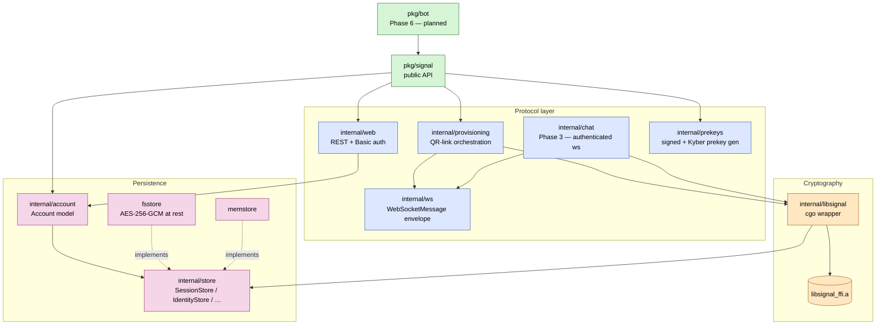

# Architecture

`signal-go` is layered so each ring has one job and ring-N can call
ring-N+1 but never the other way around. Cryptography always flows
through the official Rust `libsignal` via cgo; everything above it is
our Go code.

## What to look at

- **Dashed lines** are "satisfies the interface", not "imports". The
  store layer is plug-in: `fsstore` and `memstore` both implement
  `internal/store` and `account.Store`.
- The cgo seam is exactly one package — `internal/libsignal`. Anyone
  auditing the crypto trust story only has to read it.
- `pkg/signal` is what library consumers depend on. Nothing above it
  (your bot, your bridge, `pkg/bot` itself) needs to know about cgo or
  Signal's wire protocol.

## Linked design records

- [ADR 0001 — Overall architecture](../adr/0001-overall-architecture.md)
- [ADR 0002 — No third-party Go deps (allowlist)](../adr/0002-no-third-party-go-deps.md)
- [ADR 0005 — Storage interface](../adr/0005-store-interface.md)
