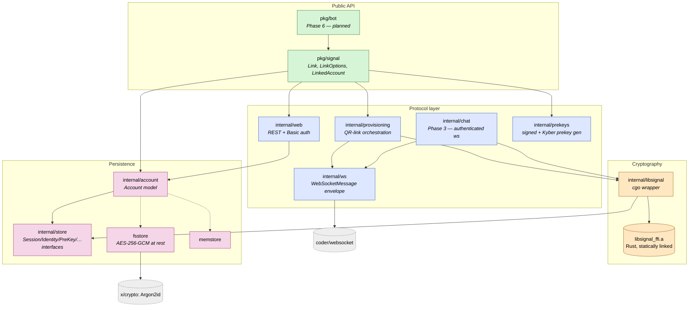

# Architecture

`signal-go` is layered so each ring has one job and ring-N can call ring-N+1
but never the other way around. Cryptography always flows through the
official Rust `libsignal` via cgo; everything above it is our Go code.

## What to look at

- **Dashed lines** (`mem` / `fs` from `account`) mean "satisfies the
  interface" rather than "imports". The store is plug-in.
- The cgo seam is exactly one package — `internal/libsignal`. Anyone
  auditing the crypto trust story only has to read it.
- `pkg/signal` is what library consumers depend on. Nothing above it
  (e.g. `pkg/bot`, your bot, your bridge) needs to know about cgo or
  Signal's wire protocol.

## Linked design records

- [ADR 0001 — Overall architecture](../adr/0001-overall-architecture.md)
- [ADR 0002 — No third-party Go deps (allowlist)](../adr/0002-no-third-party-go-deps.md)
- [ADR 0005 — Storage interface](../adr/0005-store-interface.md)
