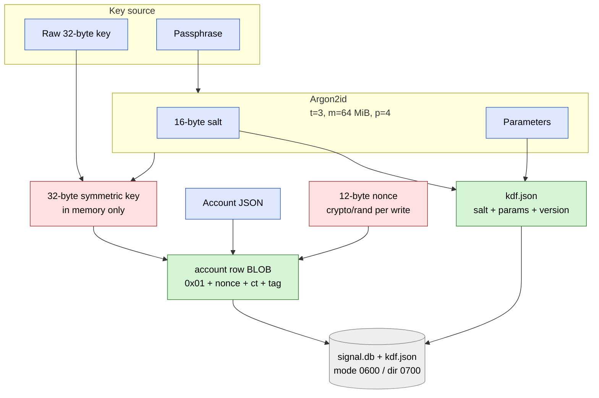

# Encrypted store

[seal](../../internal/store/seal/) seals the account JSON under AES-256-GCM.
[sqlstore](../../internal/store/sqlstore/) stores the ciphertext in `signal.db`;
the 32-byte symmetric key never touches disk. The caller either supplies it
directly (OS keyring / HSM / TPM-sealed) or derives it from a passphrase via
Argon2id (`kdf.json` beside the store directory).



## What to look at

- **The key is never persisted.** Only inputs to the KDF (salt +
  parameters) hit disk; the derived 32 bytes live in `*sqlstore.DB` for the
  process lifetime and die with the process.
- **GCM nonce is fresh per write.** Two saves of the same account
  produce different ciphertexts. Reused nonces under AES-GCM are
  catastrophic — see `internal/store/seal/seal_test.go`.
- **Wrong passphrase fails closed.** Argon2id-deriving with the wrong
  passphrase yields a different key, the GCM tag check fails, and
  `LoadAccount` returns `seal.ErrWrongPassphrase` so callers can re-prompt.
- **Legacy fsstore rejected.** Directories with `account.enc` or
  `account.json` from the removed fsstore package must be migrated manually
  (fresh link) before `sqlstore.Open*`.

## On-disk layout

```
store-dir/
├── kdf.json      # passphrase mode only (0600)
└── signal.db     # SQLite WAL; account BLOB + libsignal tables (0600)
```

Parent directory mode `0700`.
