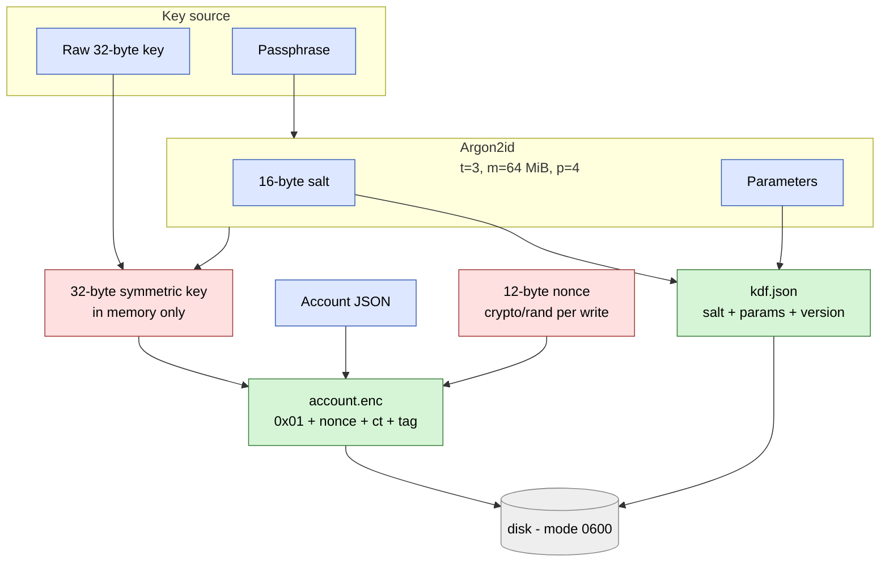

# Encrypted store

`fsstore` writes the account JSON sealed under AES-256-GCM. The 32-byte
symmetric key never touches disk; the caller either supplies it directly
(OS keyring / HSM / TPM-sealed) or has it derived from a passphrase via
Argon2id.



## What to look at

- **The key is never persisted.** Only inputs to the KDF (salt +
  parameters) hit disk; the derived 32 bytes live in the `*fsstore.Store`
  for the process lifetime and die with the process.
- **GCM nonce is fresh per write.** Two saves of the same account
  produce different ciphertexts. Reused nonces under AES-GCM are
  catastrophic — see the tests in `internal/store/fsstore/encryption_test.go`
  for the explicit assertion.
- **Wrong passphrase fails closed.** Argon2id-deriving with the wrong
  passphrase yields a different key, the GCM tag check fails, and
  `LoadAccount` returns a typed `ErrWrongPassphrase` so callers can
  re-prompt rather than crash.
- **Mode mixing is rejected.** A directory with `account.json` blocks
  encrypted constructors with `ErrDirPlaintext`; one with `account.enc`
  blocks `New` with `ErrDirEncrypted`. No silent leftovers.

## On-disk layout

```
.signal-data/
├── kdf.json          (passphrase mode only: salt + Argon2id params)
└── account.enc       (0x01 || 12-byte nonce || ciphertext || 16-byte GCM tag)
```

## Linked design records

- [ADR 0012 — Encrypted account store](../adr/0012-encrypted-store.md)
- [ADR 0011 — Threat model & security audit](../adr/0011-security-audit.md)
- [security.md](../security.md) — short threat model + reporting policy
