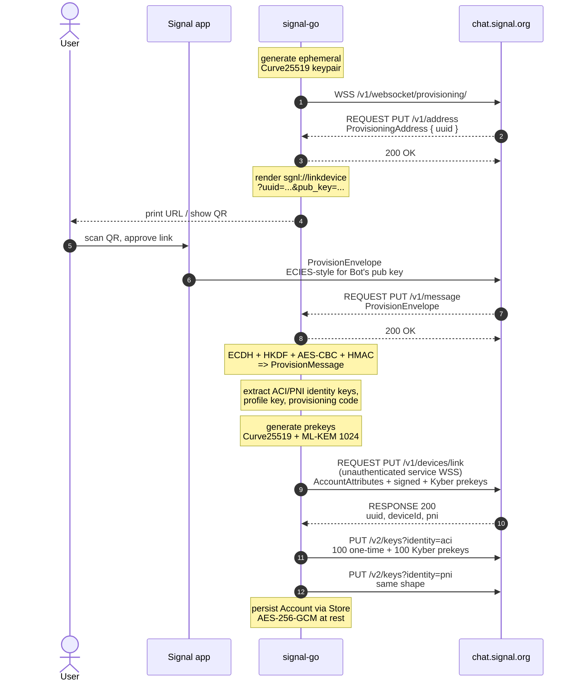

# QR-link flow

The full sequence the secondary device (our process) runs to pair with
the user's primary Signal app and get a registered, persistable account.
This is what `signal.Link` does end-to-end.

## What to look at

- **Steps 1–6** are the unauthenticated provisioning websocket. Signal
  uses it as a rendezvous channel between the two devices; no account
  exists yet.
- **Step 11 (ECDH + HKDF + AES-CBC + HMAC)** is the
  [ProvisioningCipher](https://github.com/signalapp/libsignal). We use
  libsignal for the ECDH and HKDF; AES-CBC and HMAC come from Go stdlib
  (commodity primitives; key material itself flows through libsignal).
- **Step 13 (prekey generation)** mints two namespaces' worth of keys:
  ACI and PNI. PQXDH is mandatory upstream, so the Kyber/ML-KEM last-
  resort prekey ships at link time.
- **Step 14** registers the device over the **unauthenticated service
  websocket** (production returns HTTP 498 on REST, HTTP 404 on the
  provisioning socket). **Steps 15–16** are REST
  `PUT /v2/keys` calls that populate one-time prekey batches recipients
  need to send us new messages.
- **The final persist** uses [the encrypted store](./encrypted-store.md)
  by default — `signal-go link` prompts for a passphrase.

## Linked design records

- [Phase 2 plan](../../ROADMAP.md#phase-2--complete-the-link-done-except-where-noted)
- [Signal PQXDH spec](https://signal.org/docs/specifications/pqxdh/)
- [Synchronised start for linked devices](https://signal.org/blog/a-synchronized-start-for-linked-devices/) (Phase 7)
