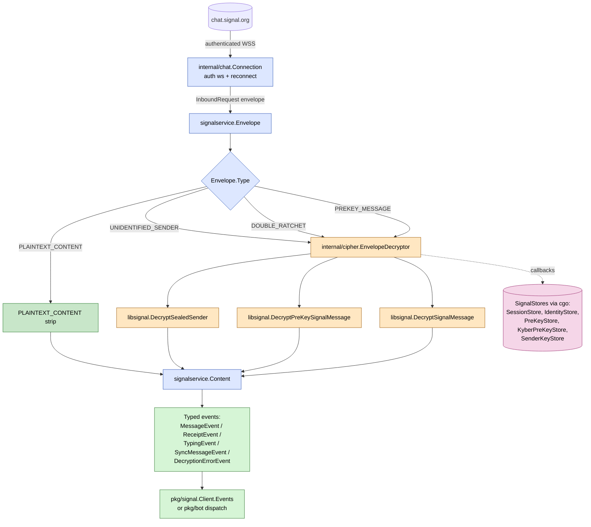

# Receive pipeline (Phase 3)

How an inbound Signal message travels from the chat websocket all
the way up to a typed event the caller can switch on. Design is
in [ADR 0010](../adr/0010-phase-3-receive.md).

## Current status

- **Implemented**: authenticated websocket (`internal/chat`), event
  dispatch (`pkg/signal.Client`), typed events, and libsignal-backed
  decrypt via [`internal/cipher.EnvelopeDecryptor`](../internal/cipher/envelope.go)
  (default for [`signal.Open`](../pkg/signal/client.go)).
- **Still open**: prekey rotation on use + top-up (Phase 3 follow-up),
  sender-key / group decrypt (Phase 5), multi-recipient sealed-sender
  edge cases.

## What to look at

- **The cgo callback structs are wired** in `internal/libsignal/stores.go`.
  Load callbacks return `0` with a **null** out-pointer on
  `store.ErrRecordNotFound` (libsignal FFI treats any non-zero return
  as an error).
- **One bad envelope must never kill the loop.** A failed decrypt
  emits a `DecryptionErrorEvent` and the next envelope continues.
- **`PLAINTEXT_CONTENT`** is used for sync messages and decryption-error
  receipts from peers; the leading marker byte is stripped before
  parsing `Content`.
- **Reconnect/backoff** lives in `internal/chat`. Capped exponential
  with jitter (1s … 60s).

## Linked design records

- [ADR 0010 — Phase 3 receive](../adr/0010-phase-3-receive.md)
- [ADR 0005 — Store interface](../adr/0005-store-interface.md)
- [Sealed Sender (Signal blog)](https://signal.org/blog/sealed-sender/)
