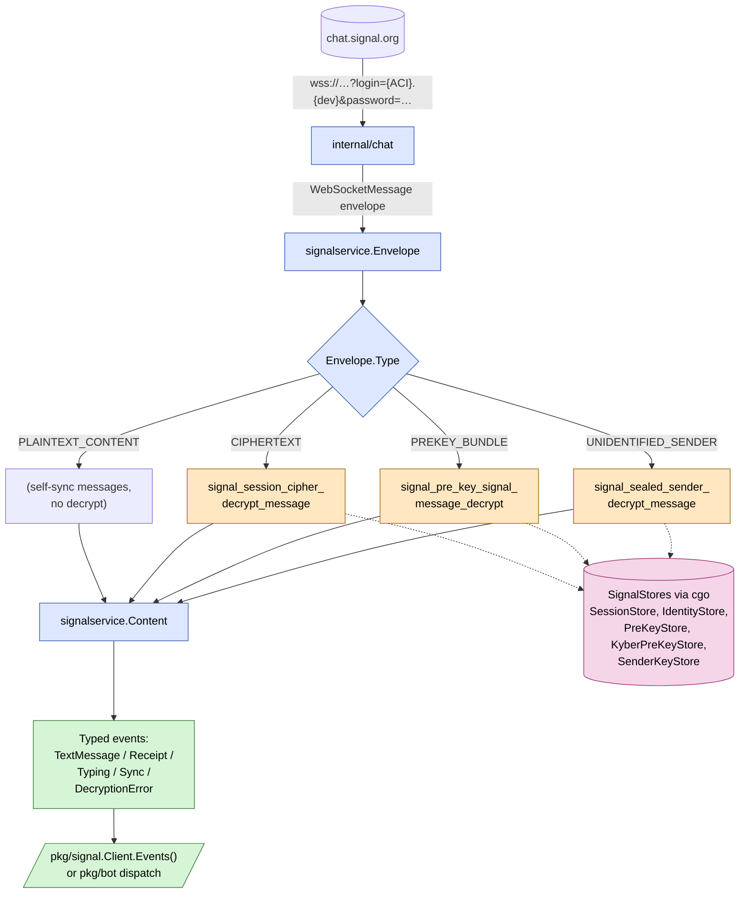

# Receive pipeline (Phase 3 — planned)

How an inbound Signal message will travel from the chat websocket all
the way up to a typed event the caller can switch on. This shape is
locked in [ADR 0010](../adr/0010-phase-3-receive.md); implementation
lands incrementally on this branch.

## What to look at

- **The cgo callback structs are already wired** (Phase 3b). Each of the
  three decrypt entrypoints takes one or more of those structs, and
  libsignal calls back into our `//export`'d shells in
  `internal/libsignal/stores.go`. They forward to a per-type
  `*Impl` function (in `stores_impl.go`) that's cgo-free and unit-tested.
- **One bad envelope must never kill the loop.** A failed decrypt
  emits a `DecryptionErrorEvent` and the next envelope continues. The
  trust-on-first-use + safety-number-changed events come out of the
  IdentityStore callback path.
- **PLAINTEXT_CONTENT** is Signal's own sync mechanism for messages we
  sent from a different device on the same account; no decrypt needed.
- **Reconnect/backoff** lives in `internal/chat`. Capped exponential
  with jitter (1s … 60s). Each reconnect re-runs the auth handshake;
  the dispatch loop treats it as transparent.

## Linked design records

- [ADR 0010 — Receive pipeline architecture](../adr/0010-phase-3-receive.md)
- [Roadmap Phase 3](../../ROADMAP.md#phase-3--receive-in-progress)
- [Sealed Sender (Signal blog)](https://signal.org/blog/sealed-sender/)
