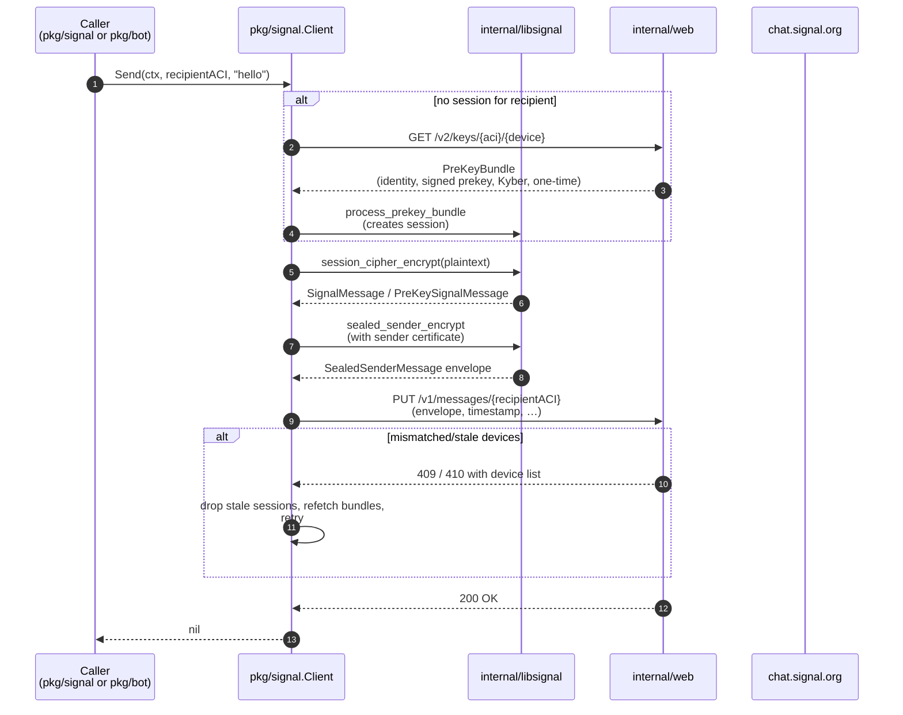

# Send flow (Phase 4 — planned)

Sending a 1:1 message. The full design lives with Phase 4; this is the
target shape so the public API and the receive pipeline don't end up
incompatible with it.

## What to look at

- **Session establishment** happens lazily on the first send to a
  recipient. Subsequent sends reuse the Double Ratchet state from the
  SessionStore.
- **Sealed sender** is the default. Recipients get an `Envelope` that
  doesn't reveal the sender's ACI to the server. The sender certificate
  is fetched from `/v1/certificate/delivery` and cached.
- **Mismatched/stale devices** (HTTP 409 / 410 with a device list) are
  the server telling us the recipient has added or removed a device
  since we last fetched their bundle. We drop the corresponding
  sessions, refetch, and resend.

## Linked design records

- [Roadmap Phase 4](../../ROADMAP.md#phase-4--send-11-planned)
- [Sealed Sender (Signal blog)](https://signal.org/blog/sealed-sender/)
