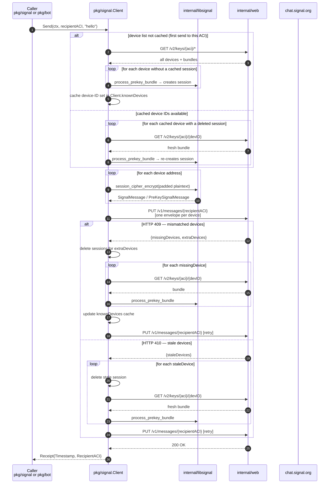

# Send flow (Phase 4 — shipped)

Sending a 1:1 message. Fan-out, retry, and basic-auth send are live.
Sealed-sender is the next planned enhancement.

## What to look at

- **Session establishment** happens on the first send to a recipient via
  `discoverAndEnsureSessions`. Subsequent sends reuse cached sessions and
  the in-memory device-ID map.
- **Fan-out**: one `SignalMessage` per device is assembled and sent in a
  single PUT. Each envelope is independently encrypted with the device's
  Double Ratchet session.
- **Retry**: at most one retry on 409/410. A second failure propagates
  to the caller.
- **Sealed sender** is the next planned enhancement. Recipients would
  receive envelopes that don't reveal the sender's ACI to the server.
  Requires `signal_sealed_sender_multi_recipient_encrypt` wrapper +
  sender-certificate cache.

## Linked design records

- [ADR 0014 — Send retry and multi-device fan-out strategy](../adr/0014-send-retry-fanout.md)
- [Roadmap Phase 4](../../ROADMAP.md#phase-4--send-11-in-progress)
- [Sealed Sender (Signal blog)](https://signal.org/blog/sealed-sender/)
