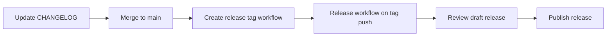

# Releasing signal-go

This guide is for maintainers cutting pre-release or stable tags. Binary
builds and draft GitHub Releases are automated; publishing the release
stays a manual step.

## Overview



| Step | What runs | Output |
|------|-----------|--------|
| 1 | You edit `CHANGELOG.md` | `## [x.y.z]` section ready |
| 2 | **Create release tag** (`create-release-tag.yml`) | Annotated `v*` tag on `origin` |
| 3 | **Release** (`release.yml`, automatic on tag push) | Five platform archives + `.sha256` on a **draft** release |
| 4 | You in GitHub UI | Published release + downloadable assets |

Design rationale: [ADR 0033](../adr/0033-release-pipeline.md).

## Before you tag

1. **`main` is green** — latest CI on the commit you intend to ship.
2. **`CHANGELOG.md`** — move notes from `[Unreleased]` into a dated section:
   ```markdown
   ## [0.1.0-rc2] - 2026-05-22
   ### Fixed
   - …
   ```
   Keep `[Unreleased]` empty (or “Nothing yet.”) after the move. Update the
   compare link at the bottom:
   ```markdown
   [Unreleased]: https://github.com/thehappydinoa/signal-go/compare/v0.1.0-rc2...HEAD
   [0.1.0-rc2]: https://github.com/thehappydinoa/signal-go/releases/tag/v0.1.0-rc2
   ```
3. **ROADMAP** — tick or re-scope items if this release closes a phase slice.
4. **Version in `cmd/signal-go`** — release builds inject the tag via
   `-ldflags` in `release.yml`; no manual bump in source required.

## Create the tag (GitHub Actions)

1. Open **Actions → Create release tag → Run workflow**.
2. Inputs:
   - **version** — `0.1.0-rc2` or `v0.1.0-rc2` (workflow normalizes to `v…`).
   - **ref** — usually `main` (branch or full SHA).
   - **require_changelog** — leave enabled so the job fails if `## [version]`
     is missing.
3. Run. The workflow creates an annotated tag and `git push origin v…`.

That push triggers **Release** automatically (`on.push.tags: v*`).

### Dry-run without tagging

To exercise the build matrix **without** creating a release:

- **Actions → Release → Run workflow** (`workflow_dispatch`).
- Optional **tag** input only names artifacts (default `v0.0.0-dryrun`).
- Archives stay as workflow artifacts (7-day retention); **no** draft GitHub
  Release is created.

## After the build

1. **Actions → Release** — wait for all matrix legs (Windows is
   `experimental: true` and may fail without blocking other platforms).
2. **Releases** — open the new **Draft** for your tag.
3. Verify asset names, `.sha256` sidecars, and generated notes.
4. Click **Publish release** when satisfied.

### Build provenance (optional)

`actions/attest-build-provenance` runs only when:

- The ref is a real `v*` tag (not a manual Release dry-run), and
- Repo variable `ENABLE_BUILD_PROVENANCE` is `true`.

GitHub Artifact Attestations are unavailable on **user-owned private**
repositories; enable after the repo is public or on a supporting org plan.
See [ADR 0033](../adr/0033-release-pipeline.md).

## Local smoke test (optional)

```sh
task libsignal
task build
./bin/signal-go version
```

Cross-compiled release binaries are built only in CI; local `task build`
produces a dev binary tagged `(devel)` unless you pass `-ldflags` yourself.

## Troubleshooting

| Symptom | Check |
|---------|--------|
| Create tag fails on CHANGELOG | Add `## [x.y.z] - YYYY-MM-DD` matching the version input (no `v` prefix in the heading). |
| Tag already exists | Pick a new version or delete the remote tag only if the release was mistaken. |
| Release workflow did not start | Confirm the tag matches `v*` and was pushed to `origin`. |
| Windows leg failed | See [getting-started — Windows](./getting-started.md#windows-git-bash--msys2); other platforms may still have published assets. |
| Empty draft release | `publish` job only runs on tag push, not on Release `workflow_dispatch`. |
